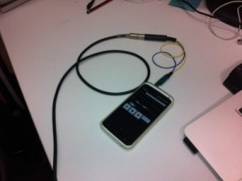

<!--  -->

Love the look of the iRig, but decided to try the home made option. Quick trip to Jaycar, and for less than $10, voila - version 1. Need to add the headphone part obviously, but that can wait. Getting audio in to my android Two Track program successfully. Probably easier to buy an adaptor from [kVconnection](https://www.kvconnection.com/Articles.asp?ID=165). Useful info there on which sleeves are what - 3 is ground and 4 record on my phone (HTC One X).
